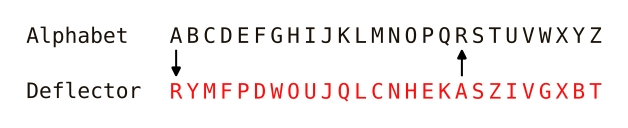

# Python Enigma
This python console app simulates the mechanism of the Enigma Machine using code.
To use it, just run the `main.py` file in this project. Then, follow these steps:

1. Select the encryption disks you will use. You must choose three.
2. Select the encryption disks initial rotation. You must input numbers between 0 and 25. The rotation can be differente for each disk.
3. Select if you will modify the plugboard. The plugboard can alter the encryption process by swapping two letters.
4. If you chose to add plugboard modifications, write them using this syntax: "XY". This means that the first letter will be replaced with the second one during encryption. They can't be the same, so "AA" or "XX" is not allowed. Also, it's not allowed to add two modifications for the same letter, so you can't add "XY" and "ZX" at the same time. You can add more than one modification by separating them with commas, like this: "XY, ZO, MN".
5. Once you added plugboard modifications, the app will display if they were successful or not.
6. Finally, write the text to encrypt. Numbers and letters ranging from A to Z can be used. Symbols are not allowed in the message.
7. The encrypted text is displayed.

To decrypt a message from the enigma machine, follow steps 1 to 5 to set the same configuration that was used to encrypt it, and write the encrypted message at step 6. Then, you'll get the decrypted text.

## Advanced Configurations
You can modify the encryption keys stored in the `constants.py` file. They are written using the following rules:

- Each one of them is 26 characters long
- They can only contain uppercase vowels and consonants, ranging from A to Z
- They can't have the same character repeated, each one of them has to be different

The default app contains four disk keys, but the user can choose to add more.

### Custom Deflector
The `constants.py` file also contains a deflector key. This is a special encryption key. It can be customized like the disk keys, but it has to follow a special rule.

As it can be seen in this image, the normal alphabet has an A at the first position, and an R at the 18th position. In the deflector key, those letters change places, the A being at the 18th one and the R at the first one. All the other characters must follow the same rule.
